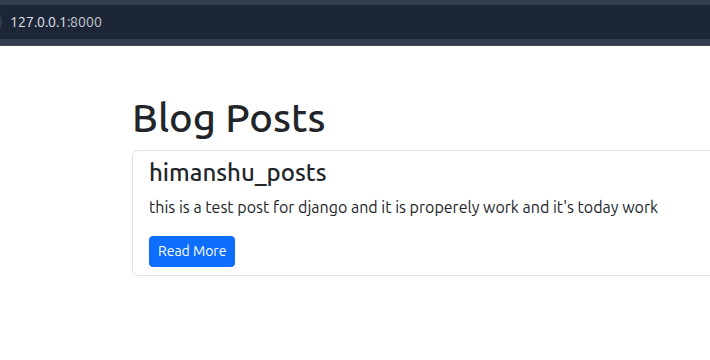
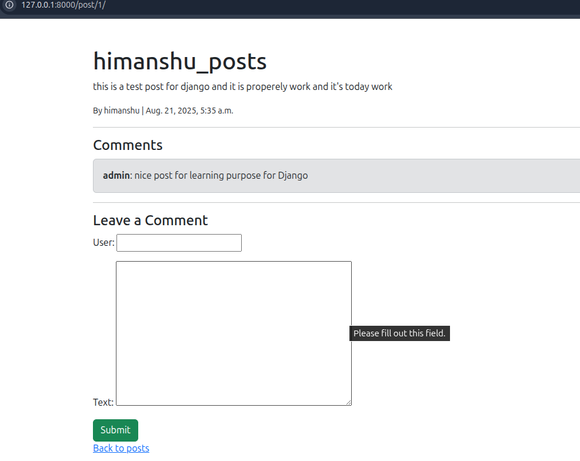
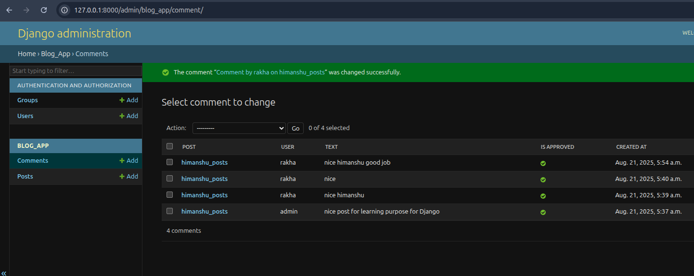

# 📝 Django Blog Project with Comments

A simple **Django Blog Application** where users can:
- Create blog posts
- View all posts
- Add comments to posts
- Manage posts & comments from Django Admin

---

## ⚙️ Setup Instructions

### 1. Clone the Repository
```bash
git clone https://github.com/your-username/django-blog.git
cd django-blog
2. Create Virtual Environment & Install Dependencies
bash

python3 -m venv venv
source venv/bin/activate   # Linux / Mac
venv\Scripts\activate      # Windows

pip install -r requirements.txt
requirements.txt should contain:

text

Django>=4.2
3. Run Migrations
bash

python manage.py migrate
4. Create Superuser
bash

python manage.py createsuperuser
5. Run Development Server
bash

python manage.py runserver
Visit 👉 http://127.0.0.1:8000/

📂 Project Structure
csharp

blog_project/
│── blog_app/
│   ├── migrations/
│   ├── templates/
│   │   ├── base.html
│   │   ├── post_list.html
│   │   ├── post_detail.html
│   ├── models.py
│   ├── views.py
│   ├── urls.py
│   ├── admin.py
│
│── blog_project/
│   ├── settings.py
│   ├── urls.py
│
│── manage.py
│── requirements.txt
│── README.md
🛠 Models
Post Model
python
class Post(models.Model):
    title = models.CharField(max_length=200)
    content = models.TextField()
    created_at = models.DateTimeField(auto_now_add=True)

    def __str__(self):
        return self.title
Comment Model
python
class Comment(models.Model):
    post = models.ForeignKey(Post, on_delete=models.CASCADE, related_name="comments")
    author = models.CharField(max_length=100)
    text = models.TextField()
    created_at = models.DateTimeField(auto_now_add=True)

    def __str__(self):
        return f"Comment by {self.author}"
🌐 URL Routing
blog_project/urls.py

python

from django.contrib import admin
from django.urls import path, include

urlpatterns = [
    path("admin/", admin.site.urls),
    path("", include("blog_app.urls")),
]
blog_app/urls.py

python

from django.urls import path
from . import views

urlpatterns = [
    path("", views.post_list, name="post_list"),
    path("post/<int:pk>/", views.post_detail, name="post_detail"),
]
👀 Views
python

from django.shortcuts import render, get_object_or_404, redirect
from .models import Post, Comment
from .forms import CommentForm

def post_list(request):
    posts = Post.objects.all().order_by("-created_at")
    return render(request, "post_list.html", {"posts": posts})

def post_detail(request, pk):
    post = get_object_or_404(Post, pk=pk)
    comments = post.comments.all()
    if request.method == "POST":
        form = CommentForm(request.POST)
        if form.is_valid():
            comment = form.save(commit=False)
            comment.post = post
            comment.save()
            return redirect("post_detail", pk=post.pk)
    else:
        form = CommentForm()
    return render(request, "post_detail.html", {"post": post, "comments": comments, "form": form})
📝 Templates
templates/base.html

html

<!DOCTYPE html>
<html>
<head>
    <title>Django Blog</title>
</head>
<body>
    <h1><a href="/">My Blog</a></h1>
    <hr>
    
</body>
</html>
templates/post_list.html

html



  <h2>All Blog Posts</h2>
  
    <h3><a href="">{{ post.title }}</a></h3>
    <p>{{ post.content|truncatewords:20 }}</p>
  
    <p>No posts yet.</p>
  

templates/post_detail.html

html



  <h2>{{ post.title }}</h2>
  <p>{{ post.content }}</p>
  <hr>
  <h3>Comments</h3>
  
    <p><b>{{ comment.author }}</b>: {{ comment.text }}</p>
  
    <p>No comments yet.</p>
  
  <hr>
  <h3>Add a Comment</h3>
  <form method="post">
      
      {{ form.as_p }}
      <button type="submit">Post Comment</button>
  </form>

📸 Screenshots
🏠 Blog Homepage (Post List)

📄 Post Detail with Comments

🔑 Django Admin Panel

(Save your screenshots inside a folder named screenshot/ in the project root)

✅ Features
Blog Post Creation via Admin

Comment Support for Each Post

Simple & Clean Templates

Django Admin Integration

🚀 Future Improvements
User Authentication for Comments

Edit/Delete Options for Posts & Comments

Like/Dislike System

👨‍💻 Author
Developed by Himanshu Changil